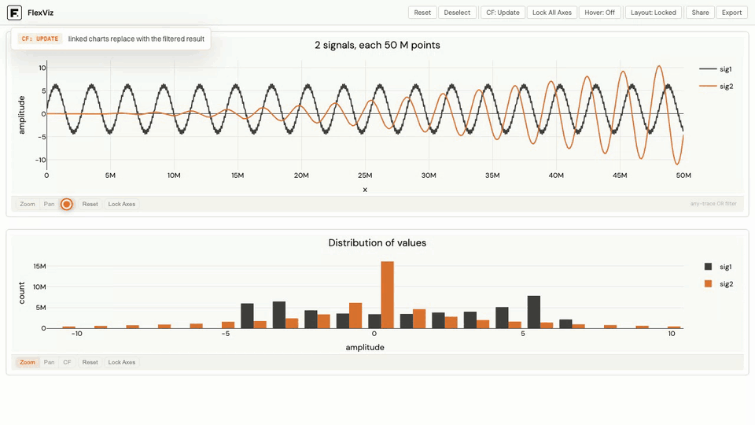

# FlexViz

**FlexViz is the open-source engine for interactive data exploration at scale, agent-native.**

FlexViz keeps charts interactive (zoom, brush, cross-filter) on datasets far
too big for conventional Python dashboarding tools. Every interaction is
answered by lazy [Polars](https://pola.rs) aggregations and Rust kernels
instead of shipping raw data to the browser. The same engine serves a coding
agent: it builds the dashboard, hands you the URL, and reads back what you
zoomed and brushed. You explore the data together, and neither of you loads
it.

[](https://flexviz.tech/demo.html)

Try it yourself on 2 x 100M rows in the
[live demo](https://flexviz.tech/demo.html).

!!! warning "Pre-1.0"
    FlexViz is under active development. APIs, defaults, and the spec format
    may change between minor releases. Bug reports are very welcome on
    [GitHub](https://github.com/flex-analytics/flexviz/issues).

## Install

```bash
pip install flexviz
```

The Rust kernels arrive as a prebuilt wheel (`flexviz-polars`) on Linux
(x86_64, aarch64), macOS (Intel and Apple silicon), and Windows (x64). Any
other platform builds them from source and needs a Rust toolchain.

## Quickstart

Run this after `pip install flexviz` or `uv add flexviz`. 
It generates 10 million rows and opens two linked figures.

```python
import numpy as np
import polars as pl

from flexviz import Dashboard

n = 10_000_000
value = np.sin(np.arange(n) / 5e4) + np.random.default_rng(0).standard_normal(n) * 0.05
value[6_000_000:6_050_000] += 3.0  # a 0.5% burst
ts = pl.datetime(2024, 1, 1) + pl.duration(milliseconds=pl.int_range(n) * 10)
df = pl.select(timestamp=ts, value=pl.Series(value))

dash = Dashboard(df, cache=True)
dash.add_figure(title="value").add_line(x="timestamp", y="value", n_points=2000)
dash.add_figure(title="distribution").add_histogram(x="value", bins=60)
dash.show()
```

Try:

- Zoom the line near 16:40 on Jan 1 to see the shape of the burst.
- Brush the histogram above value 2. Only the burst remains in the line.

See [Cross-filtering](guides/cross-filtering.md) and
[Sharing views](guides/sharing.md) for more on these interactions.

The same script lives at `examples/quickstart_10m.py`.

### Your own data

```python
import polars as pl
from flexviz import Dashboard

lf = pl.scan_parquet("readings.parquet")  # 100M rows, stays lazy

dash = Dashboard(lf)
dash.add_figure().add_line(x="timestamp", y="value")
dash.add_figure().add_histogram(x="value", bins=50)
dash.show()
```

The `LazyFrame` stays lazy. FlexViz loads nothing until a chart needs it.

Outside a notebook, `show()` blocks until Ctrl-C. Pass `block=False` to
return at once.

A single standalone figure works the same way, with multiple traces on one
canvas:

```python
from flexviz import Figure

fig = Figure(lf)
fig.add_line(x="timestamp", y="temperature", name="Temp")
fig.add_line(x="timestamp", y="humidity", name="Hum")
fig.title("Sensor data")
fig.show(port="auto")
```

## Agents

FlexViz is built as an AI-native tool: a coding agent hands you a live
dashboard instead of a static plot, then keeps working from what you find in
it.

Today, agents can already write plotting code. The trouble starts after that.
Plotting libraries cannot draw 100M points, so the figure comes out slow,
unreadable, or not at all. What does arrive is a static image. You cannot zoom
into the part that looks odd. And the agent cannot see what you did with the
figure, short of a screenshot and a guess at the pixels.

FlexViz removes all three limits. The agent writes a spec instead of plotting
code. The engine answers every zoom, brush, and cross-filter against the raw
rows, so the chart stays interactive at full size. And your interactions
travel back as a spec, not as pixels: the agent reads your exact viewport and
selections.

Install the packaged agent skill into your project, or under `$HOME` for
every project:

```bash
flexviz skill install
flexviz skill install --user
```

Claude Code and Codex can install the skill as a plugin instead, before the
package is in the project:

```
/plugin marketplace add flex-analytics/flexviz
/plugin install flexviz@flex-analytics
```

```bash
codex plugin marketplace add flex-analytics/flexviz
codex plugin add flexviz@flex-analytics
```

Then ask your agent to explore `readings.parquet`. It reads the schema, serves
the file, and gives you the URL. From there you explore together: you zoom and
brush, and the agent reads your viewport and selections back through
`window.flexvizState()` or the **Share** button. It can discuss what you have
in front of you, compute statistics on exactly the rows you brushed, and build
a new view when you ask for one.

See [Agents](guides/ai-agents.md) for the full loop and the privacy notes.

## Why it scales

- **Polars-native.** Your data stays a lazy `LazyFrame` until the moment a
  chart needs an aggregate. In-memory frames and Parquet-backed sources both
  work. That laziness is what gives out-of-core support: sources larger than
  RAM stream rather than load, so peak memory stays flat as the row count
  grows instead of scaling with it. A 1B-row, 24 GB Parquet source drives a
  line and histogram dashboard, including zoom and cross-filter, in under
  400 MB of resident memory. `make test-ooc` asserts that flatness per trace.
  Box plots are the exception, because Polars computes quantiles in memory.
- **Rust kernels.** Line downsampling and fixed-bin histogram binning run as
  parallel Polars expression plugins at memory-bandwidth speed.
- **Aggregates over the wire.** The browser receives a few thousand points
  per trace, never the raw rows.
- **Stateless server.** The client owns all interaction state and every
  request carries the complete dashboard spec. No sessions, no server
  affinity, and shareable URLs fall out for free.

Latest benchmark results:
[flexviz.tech/benchmarks](https://flexviz.tech/benchmarks.html).

## Trace types

`add_line`, `add_histogram`, `add_boxplot`, `add_bar`, `add_pie`,
`add_treemap`, `add_histogram2d`, `add_corr_heatmap`, `add_geo_histogram2d`,
and `add_geo_line`. See the [Figure API](api/figure.md) for every parameter.

## Where next

- [Cross-filtering](guides/cross-filtering.md): how selections filter linked
  figures, and the update vs. overlay modes.
- [Grouping](guides/grouping.md): split traces by a category column.
- [Line downsampling](guides/line-downsampling.md): the algorithms behind
  100M-point lines, and how to tune them.
- [Caching and live brushing](guides/caching-and-live-brushing.md): opt-in
  caching for static data and zero-latency brushing.
- [Embedding](guides/embedding.md): mount FlexViz into an existing FastAPI
  app.
- [Agents](guides/ai-agents.md): drive FlexViz from a coding agent and read
  back what the human explored.
